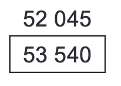
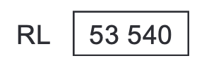
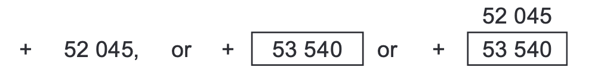

# Dimensioning  

## Use Grids and Centre Lines  
Allow the building to ‘dimension itself’ as much as possible.  
## Priority Dimensioning and Open Dimensions  
Concentrate on critical dimensions (e.g. width of escape corridor). Leave non-critical dimension out of the dimension string.  
## Expression of Levels  
Express levels to the nearest multiple of 5mm (or 0.005m). The numerals for the required levels should be enclosed in a rectangular box.   
Existing levels should not be shown as numerals only without a box.   
Where the level of an existing feature is to be varied, the existing level should be placed directly above the boc containing the required level.  
  
Where there is a possibility that levels might be confused with other numerals on drawings (eg room numbers, linear dimensions), use a prefix (eg RL for reduced level or FFL for finished floor level)   
  
  
### Job datum level  
The job datum level is generally the Australian Height Datum (AHD). If a different level is chosen, it should be clearly makerd on site plans with a short description and its level should be such that all reduced levels for the project are positive numbers.   
  
### Spot Levels  
Spot levels are used to indicate required or existing levels for a specific point or limited area and consist of a + symbol placed on the exact spot to which the level applies, followed by the numerals for the level. Proposed levels should be shown inside a box.   
  
  
### Restrict the Use of RLs  
Use relative heights ‘above finished floor level’ (AFFL) e.g. dimension the height of a handrail in millimetres.  
  
## Identify Dimensions Which Are Not Known  
Dimensions to be determined during the construction  
  
## Set-out Openings to the Critical Side only  
Do not dimension structural opening for doors and windows.  
  
## Describe Intended Outcome  
Use descriptions like ALIGN or MATCH THE HEIGHT OF EXISTING ARCHITRAVE , do not rely on dimensions only  
  
## Clarity  
Do not describe a dimension as ‘nominal’. If it is of importance, state MINIMUM or MAXIMUM.  
  

#groundcontrol #groundcontrol/principles 